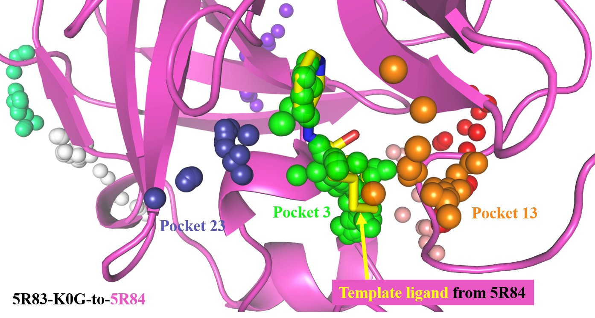

# hybrid-SA-IFD

hybrid-SA-IFD,also refers to AA/UA/CG-SA-IFD, is a workflow to refine docked poses through enhanced sampling by employing the hybrid All-Atom/United-Atom/Coarse-Grained(AA/UA/CG) model. 

## Requirements
biopython==1.81
mdtraj==1.9.9
numpy==1.23.5
oddt==0.7
openbabel==3.1.1
openmm==8.0.0
pandas==2.0.3
parmed==3.4.3
python==3.8.18
rdkit==2023.03.3
spyrmsd==0.6.0
vina==1.2.3
mdanalysis==2.0.0
Fpocket==4.1
RTMScore's environment
prody==2.1.0
AmberTools(tleap/antechamber/cpptraj)

## Usage
The workflow is divided into 2 stages. The sampling stage and the post-analysis stage.

In this tutorial we are simply present an example of cross-docking: docking and refine the ligand K0G(target ligand) from the SARS-CoV-2 5R83(target protein) to the structure of 5R84(template protein without native ligand). Because the active site in 5R84 accommodates to its own ligand, rigid docking (such as by Vina) may not yield a correct structure.

### 1.sampling stage(including structure preparation)
Head into `01-prep/01_Workflow/` and do the following:
```bash
python3 0-description.py  --config 0_config
```
The `0_config` file is used to define the number of parallel tasks, the docking mode, and the number of generated poses.
```bash
cd ../03_PrepProtein/script
sh batch_prepDock.sh
cd ../../04_Docking/script
sh 00_batch_dock.sh
sh 01_check_docking_batch.sh
cd ../../05_Refinement/script
sh 00_batch_antechamber.sh
sh 01_batch_prepareComplex.sh
sh 02_check_atom_num.sh
sh 03_batch_getPDB.sh
```
Using `Fpocket` to get core residues:(pymol is needed for visualization)
Head into `01-prep/03_PrepProtein/5R83-K0G-to-5R84`
```bash
fpocket -f apo_continue.pdb
cd apo_continue_out
```
Open pymol and enter the following command:
```bash
@apo_continue.pml
```
On insertion of the template ligand, residues predicted by Fpocket whose spheres overlapped with or are in close proximity to the template ligand are designated as core residues, as demonstrated in the following Figure. For this example, there are a total of 3 pockets respectively. It’s pocket3, pocket13, pocket23
<div align=center>

</div> 
```bash
cd pockets
cat pocket3_atm.pdb pocket13_atm.pdb pocket23_atm.pdb > pocket3-13-23.pdb
python3 ../../../../01_Workflow/utilities/core-residue-fpocket.py pocket3-13-23.pdb > core_residue.txt
```
core_residue.txt文件的末尾则输出了core residues：
There are a total of 24 residues in the core pockets, and they are :25THR 26THR 27LEU 41HIE 44CYS 49MET 52PRO 54TYR 140PHE 141LEU 142ASN 143GLY 145CYS 163HIE 164HIE 165MET 166GLU 167LEU 168PRO 170GLY 187ASP 188ARG 189GLN 190THR


将这个信息写入到02-sampling_plus_post-analysis\02_Input\aacg_job_description.csv的core_residue那一栏中

Head into `02-sampling_plus_post-analysis/` and 进行采样
AA/UA/CG modeling 的建模工具以及所需脚本需要请联系作者
当前提供的是该case已经建模好的初始结构，1-20分别代表第1-20个刚性对接的初始结构，0表示template protein以及target ligand构成的复合物。

对每一个刚性对接结构执行模拟退火，运行所需的mdp文件分别为em.mdp以及nvt.mdp，posre.itp为main chain atoms forming secondary structures in the AA and UA regions需要再高温下进行限制防止蛋白的二级结构被破坏

For each pose, 5 independent, 能量最小化以及25 rounds simulated annealing for each trajectory, were performed, saving snapshots every 1150 ps.
LSF
sh 0analysis-ie.sh
python3 1-label-ie.py
python3 2-sort-according2ie.py
python3 3-select-top500.py
python3 4.prep-cluster-traj.py
sh 5.gmxcat-genpdb.sh
python3 6.extract-top500pdb.py
python3 7.remove-boxinfo.py
python3 8.convert_uaname2aa.py
python3 9.aacg2aa.py
python3 10.separate-model.py
python3 11.copy-mol2-frcmod.py

python3 14.sum_minimized_pdb.py
python3 15.separate-pro-lig.py
obabel -ipdb lig.pdb -O lig.sdf
python3 16a.extract_pocket.py
python3 16b.process_failed_pocket.py
python3 17-1.separate-pairs.py
python3 17-2.rtmscore4all.py

python3 18.modified_total_out.py
python3 19-summary.py
sh 20.execute.sh
python3 21-rank_holo_pocket_cluster.py
 using extract_pdb_from_total_openmm.py to extract the AA model.

output见zenodo


参考文献记得附上rtmscore